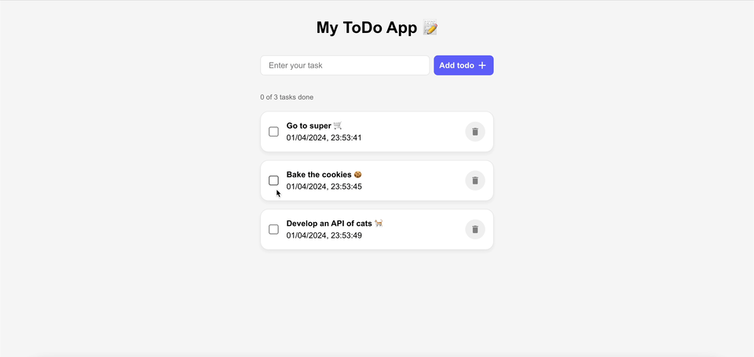

# To do App (Frontend Repo)

This is the frontend repo of the To Do app project.
This project was an exercise proposed by the teachers at Nuclio School during the Full Stack Developer Bootcamp.

This To Do App enables the user to create, complete and delete to do tasks.

## Screenshots



## Tech Stack

**Client:** React

**Server (not included in this repo):** Node, Express

**DataBase:** MongoDB

## Installation

1. Clone the repository and navigate to the project directory.

```bash
  cd reto-6-todo-app-Ruben26rcz
```

2. Install MenuBot with npm

```bash
  npm install
```

3. Run the project in the terminal with the following command:

```bash
  npm run dev
```

4. Navigate to http://localhost:5173 to view the application.
